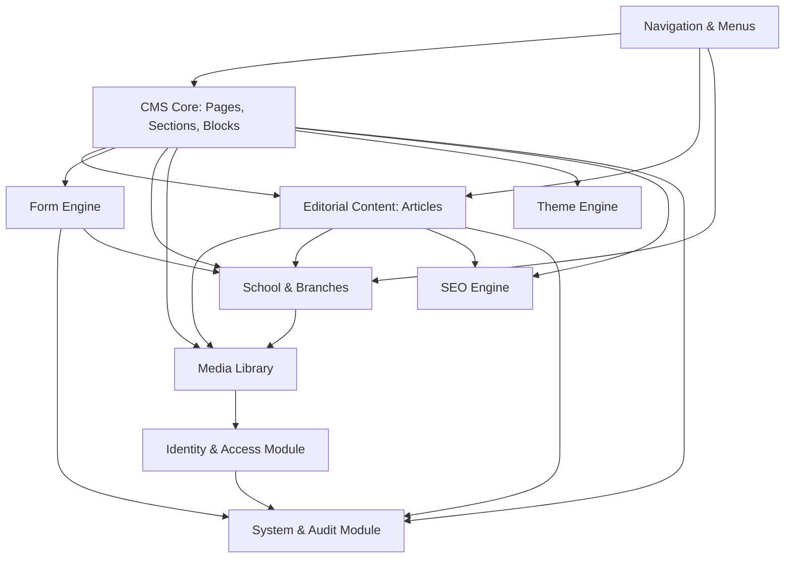

# 01. SYSTEM ARCHITECTURE SPECIFICATION
## School Website Management Framework / Modular CMS / Page Builder

---

### 1.1 TỔNG QUAN KIẾN TRÚC VÀ CÁC LỚP HỆ THỐNG (LAYERED ARCHITECTURE)

Hệ thống được thiết kế theo mô hình **Clean Architecture / Domain-Driven Design (DDD)** kết hợp mô hình **Data-driven & Configuration-driven CMS**. Mọi hiển thị trên Website công cộng đều là kết quả của việc giải mã cấu hình (Layout + Data Schema) do Admin Dashboard phát hành, loại bỏ hoàn toàn việc hard-code trang tĩnh.

#### Sơ đồ 1: Luồng quản trị (Admin Data Management Flow)

```text
       [ Admin / Editor ]
               │
               ▼
       ┌───────────────────────────────┐
       │   Admin UI (Next.js / React)  │  ◄── WYSIWYG, Page Builder, Settings
       └───────────────┬───────────────┘
                       │ HTTPS / REST / tRPC (JWT / HttpOnly Cookie)
                       ▼
       ┌───────────────────────────────┐
       │     API Gateway / Routing     │  ◄── Rate Limiter, RBAC Guard, Input Validation (Zod)
       └───────────────┬───────────────┘
                       │
                       ▼
       ┌───────────────────────────────┐
       │       Application Layer       │  ◄── Use Cases, CQRS Handlers, Orchestration, Audit Events
       └───────────────┬───────────────┘
                       │
                       ▼
       ┌───────────────────────────────┐
       │         Domain Layer          │  ◄── Entities, Value Objects, Domain Rules, Block Registry
       └───────────────┬───────────────┘
                       │
                       ▼
       ┌───────────────────────────────┐
       │     Infrastructure Layer      │  ◄── ORM (Prisma/Drizzle), S3 Client, Redis, Mailer
       └───────────────┬───────────────┘
                       │
                       ▼
       ┌───────────────────────────────┐
       │   Database (PostgreSQL 16)    │  ◄── Relational Data, JSONB Layout Configs, Revisions
       └───────────────────────────────┘
```

#### Sơ đồ 2: Luồng hiển thị công cộng (Visitor Public Rendering Flow)

```text
       [ Anonymous Visitor / Parent / Student ]
                       │
                       ▼
       ┌───────────────────────────────┐
       │    Cloudflare CDN / Edge      │  ◄── Full-page Edge Cache (HTML), Asset Caching
       └───────────────┬───────────────┘
                       │ Edge Cache MISS
                       ▼
       ┌───────────────────────────────┐
       │   Public Web App (Next.js)    │  ◄── App Router (Server Components - RSC)
       │    [ Dynamic Layout Engine ]  │
       └───────────────┬───────────────┘
                       │
         ┌─────────────┴─────────────┐
         ▼                           ▼
┌──────────────────┐       ┌──────────────────────┐
│ Memory / Redis   │ (HIT) │ API / Internal CMS   │ (MISS)
│ Cache Layer      │───────│ Service Layer        │
└──────────────────┘       └──────────┬───────────┘
                                      │
                                      ▼
                           ┌──────────────────────┐
                           │ Database Read Replica│
                           └──────────────────────┘
                                      │
                                      ▼
                           ┌──────────────────────┐
                           │ Section & Block      │
                           │ Rendering Engine     │  ◄── Map Page JSON to React Block Components
                           └──────────┬───────────┘
                                      │
                                      ▼
                           ┌──────────────────────┐
                           │ Hydrated HTML Stream │  ──► Trả về Client với SEO & Core Web Vitals tối ưu
                           └──────────────────────┘
```

---

### 1.2 ĐỀ XUẤT LỰA CHỌN KIẾN TRÚC: MODULAR MONOLITH

Hệ thống được quyết định xây dựng theo mô hình **Modular Monolith (Monorepo)** thay vì Monolith truyền thống hoặc Microservices rời rạc.

#### Bảng so sánh 3 mô hình kiến trúc:

| Tiêu chí | Traditional Monolith | Microservices | **Modular Monolith (Đề xuất)** |
| :--- | :--- | :--- | :--- |
| **Tính độc lập của module** | Kém, code dễ bị spaghetti, tightly-coupled | Cao tuyệt đối qua mạng (gRPC/REST) | **Rất cao (Boundary rõ ràng qua code package)** |
| **Độ phức tạp hạ tầng** | Rất thấp (1 process, 1 DB) | Cực cao (K8s, Service Mesh, Distributed Tracing) | **Thấp - Trung bình (Single deployable unit hoặc Monorepo packages)** |
| **Hiệu năng & Network Latency** | Rất nhanh (in-memory calls) | Chậm do network overhead giữa các services | **Rất nhanh (In-memory direct function invocation)** |
| **Tính toàn vẹn dữ liệu** | Giao dịch ACID chuẩn | Distributed transactions (Saga pattern, eventual consistency) | **ACID chuẩn trên PostgreSQL, có thể tách schema khi cần** |
| **Khả năng mở rộng team** | Kém khi team > 15 người | Rất tốt cho team chia nhiều cụm | **Tốt, phân chia module rõ ràng qua Monorepo workspace** |
| **Chi phí vận hành ban đầu** | Thấp | Rất đắt đỏ | **Tối ưu, có thể host trên 1 VPS/Cloud Node cấu hình vừa** |

#### Lý do lựa chọn Modular Monolith:
1. **Tính chất của CMS cho trường học**: Dữ liệu giữa các domain có quan hệ mật thiết (Bài viết thuộc Chi nhánh, Form tuyển sinh gắn vào Trang, Trang chứa các Block liên kết tới Khóa học). Tách Microservices ở giai đoạn này sẽ dẫn đến *Distributed Monolith*, làm phức tạp hóa bài toán transaction và giảm tốc độ phát triển.
2. **Module boundaries chặt chẽ**: Mỗi module (`auth`, `cms`, `media`, `forms`, `school`, `theme`) được cô lập thành các package riêng biệt trong monorepo. Các module chỉ giao tiếp với nhau thông qua **Public Interface (Contracts/DTOs)**, không được phép import chéo trực tiếp database queries của nhau.
3. **Đường lui kiến trúc (Evolutionary Architecture)**: Khi một module phát triển quá lớn (ví dụ: `forms` hoặc `admissions` có hàng chục nghìn lượt nộp cùng lúc vào mùa tuyển sinh), module đó có thể dễ dàng tách thành một Microservice độc lập mà không cần viết lại nghiệp vụ lõi.

---

### 1.3 THIẾT KẾ CÁC DOMAIN / MODULES CHÍNH

Hệ thống được chia thành 10 Module chức năng độc lập:

```text
┌────────────────────────────────────────────────────────────────────────┐
│                          CORE FOUNDATION                               │
├──────────────────────────┬─────────────────────────┬───────────────────┤
│ 1. Identity & Access     │ 2. System & Audit       │ 3. Theme Engine   │
│ - Users, Roles, Perms    │ - Settings, Audit Logs  │ - Design Tokens   │
│ - RBAC, Auth Sessions    │ - Content Revisions     │ - CSS Vars, Layout│
└──────────────────────────┴─────────────────────────┴───────────────────┘

┌────────────────────────────────────────────────────────────────────────┐
│                           CMS & CONTENT                                │
├──────────────────────────┬─────────────────────────┬───────────────────┤
│ 4. CMS Engine (Builder)  │ 5. Editorial Content    │ 6. School Domain  │
│ - Pages, Templates       │ - Articles, Categories  │ - Branches        │
│ - Sections, Blocks       │ - Tags, Authors         │ - Programs, Campus│
├──────────────────────────┼─────────────────────────┼───────────────────┤
│ 7. Navigation Engine     │ 8. Media Library        │ 9. Form Engine    │
│ - Multi-level Menus      │ - Files, Folders, S3    │ - Dynamic Builder │
│ - Target Resolver        │ - Responsive Variants   │ - Submissions     │
└──────────────────────────┴─────────────────────────┴───────────────────┘

┌────────────────────────────────────────────────────────────────────────┐
│                        SEO & DISCOVERY ENGINE                          │
├────────────────────────────────────────────────────────────────────────┤
│ 10. SEO Engine: Metadata, OpenGraph, Canonical, JSON-LD, XML Sitemaps │
└────────────────────────────────────────────────────────────────────────┘
```

---

### 1.4 SƠ ĐỒ PHỤ THUỘC GIỮA CÁC MODULE (DEPENDENCY GRAPH)

Quy tắc bất biến: **Dependencies chỉ đi một chiều từ tầng cao xuống tầng thấp. Không có vòng lặp phụ thuộc (Cyclic Dependencies).**



---

### 1.5 CÁC TIỂU KIẾN TRÚC CHI TIẾT (SUB-ARCHITECTURES)

#### 1.5.1 Public Rendering Architecture
* **Hybrid Rendering Strategy**: Sử dụng Next.js App Router.
  * **Static Site Generation (SSG) + Incremental Static Regeneration (ISR)** cho 90% trang tĩnh (Giới thiệu, Cơ sở, Chương trình học, Bài viết).
  * **Server-Side Rendering (SSR)** cho các trang động cần dữ liệu tức thời (Tìm kiếm nâng cao, Xem trước bản nháp - Preview Mode).
  * **Client-Side Rendering (CSR)** giới hạn cho các UI tương tác cục bộ: Trình điền Form tuyển sinh, Bộ lọc khóa học tương tác, Chatbot, Video player modals.
* **On-Demand Cache Revalidation**: Khi Admin bấm nút "Publish" hoặc chỉnh sửa cấu hình trang, CMS kích hoạt cơ chế `revalidateTag(['page-${slug}', 'menu-header', 'branch-${id}'])`. CDN và Next.js Cache ngay lập tức làm mới trang trong nền mà không làm gián đoạn người xem.

#### 1.5.2 Admin Architecture
* Kiến trúc **Single Page App (SPA) / Next.js Admin App Router** độc lập với trang Public.
* Áp dụng **State Machine** cho trình dựng trang (Page Builder): Undo, Redo, Draft State, Conflict Resolution khi 2 người cùng biên tập một trang.
* Tách biệt hoàn toàn assets và bundle của Admin khỏi trang Public nhằm đảm bảo tốc độ tải trang Public đạt điểm Lighthouse 95+.

#### 1.5.3 CMS Architecture (Block-based Data Model)
* Triển khai cấu trúc cây phân cấp: `Page -> Section -> Block`.
* Mọi Block được chuẩn hóa thành một đối tượng JSON độc lập (Schema + Data).
* **Decoupled Renderer**: Data của Block chỉ là JSON thuần túy. Trình hiển thị giao diện (Renderer) chịu trách nhiệm lấy JSON đó ghép vào React Component tương ứng.

#### 1.5.4 API Architecture
* **API Style**: RESTful API chuẩn OpenAPI 3.0 cho các kết nối Public và Admin CRUD tiêu chuẩn, kết hợp tRPC / Type-safe Client cho tương tác nội bộ giữa các app trong Monorepo.
* **API Versioning**: URL-based (`/api/v1/...`) để đảm bảo các ứng dụng di động hoặc tích hợp sau này không bị ảnh hưởng khi có nâng cấp lớn.
* **Rate Limiting**: Triển khai theo thuật toán Token Bucket / Sliding Window trên Redis:
  * Public Read: 100 req/phút/IP.
  * Form Submission: 5 req/phút/IP (chống spam).
  * Admin API: 300 req/phút/User token.

#### 1.5.5 Database Architecture
* Hệ quản trị: **PostgreSQL 16+**.
* Kiến trúc lưu trữ lai: **Relational (Bảng quan hệ chuẩn 3NF)** cho các thực thể cố định (Users, Roles, Articles, Categories, Branches, Forms) kết hợp **NoSQL/JSONB** cho cấu hình động (Page Layouts, Block Properties, Dynamic Form Submissions).
* Đánh chỉ mục chuyên sâu: B-Tree Index cho Foreign Keys/Slugs, GIN Index cho JSONB fields và Full-text Search (pg_trgm).

#### 1.5.6 Authentication & Authorization Architecture
* **Authentication**: Hỗ trợ đồng thời **Session-based (HttpOnly Secure Cookie)** cho Web Portal và **Stateless JWT (Access Token + Refresh Token)** cho API/Mobile. Tích hợp sẵn chuẩn OpenID Connect / SAML để sẵn sàng kết nối Google Workspace for Education / Microsoft 365 School Accounts.
* **Authorization**: **RBAC nâng cao kết hợp Scope-based Authorization (Role-Based + Branch Scope)**:
  * Quyền không chỉ là `can_edit_article`, mà là `can_edit_article WHERE branch_id = :user_branch_id OR scope = 'GLOBAL'`.

#### 1.5.7 Media Architecture
* **Object Storage**: S3-compatible (AWS S3 / MinIO / Cloudflare R2).
* **Pipeline xử lý ảnh tự động**:
  * Client tải ảnh lên qua Pre-signed URL (giảm tải 100% cho Web Server).
  * Serverless Worker / Image Optimization Service tự động tạo các biến thể: `thumbnail (150x150)`, `medium (600x400)`, `large (1200x800)`, chuyển đổi sang định dạng hiện đại `WebP` và `AVIF`.
  * Không bao giờ lưu file trực tiếp trên Local Disk của máy chủ ứng dụng.

#### 1.5.8 Caching Architecture
* **3 tầng đệm (Multi-tier Caching)**:
  1. **Edge Cache (Cloudflare)**: Cache HTML trang tĩnh, hình ảnh, CSS, JS. TTL 1 năm cho static hash assets, TTL 1 giờ (stale-while-revalidate) cho HTML.
  2. **Application Server Cache (Next.js Data Cache / In-Memory)**: Lưu trữ các truy vấn SQL lặp lại (Danh sách Menu, Cấu hình Theme, Settings).
  3. **Shared Distributed Cache (Redis)**: Lưu trữ Sessions, Rate-limit counters, API response cache, và Pub/Sub event để đồng bộ revalidation.

#### 1.5.9 SEO Architecture
* Cơ chế **Dynamic Metadata Resolver**: Mọi Trang, Bài viết, Cơ sở, Khóa học đều có liên kết 1-1 với bản ghi `seo_metadata`.
* Tự động sinh `Schema.org JSON-LD` tương thích cấu trúc giáo dục: `EducationalOrganization`, `School`, `Article`, `Course`, `BreadcrumbList`.
* Trình tạo `sitemap.xml` tự động chia nhỏ (Sitemap Index) hỗ trợ hơn 50,000 URLs.

#### 1.5.10 Theme Architecture
* Hệ thống **CSS Variable Tokens Engine**:
  * Định nghĩa hệ thống token phân cấp: Core Tokens (Màu sắc cơ bản, Typography) -> Semantic Tokens (Primary, Background, Muted) -> Component Tokens (Button, Card, Hero).
  * Hỗ trợ nạp Theme động theo từng Cơ sở (Branch-level Theming): Cơ sở A có thể mang màu sắc nhận diện khác Cơ sở B thông qua ghi đè CSS Variables ở Root Container.
