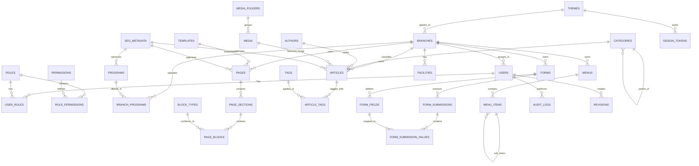

# 02. DATABASE DESIGN & ENTITY RELATIONSHIP DIAGRAM (ERD)
## PostgreSQL Scalable Enterprise Architecture

---

### 2.1 NGUYÊN TẮC THIẾT KẾ CƠ SỞ DỮ LIỆU (DATABASE PRINCIPLES)

1. **Chuẩn hóa kết hợp Bán chuẩn hóa (Hybrid 3NF & JSONB)**:
   - Các thực thể cốt lõi, quan hệ nghiệp vụ, dữ liệu tìm kiếm, phân quyền và liên kết khóa ngoại được thiết kế chuẩn hóa 3NF để bảo đảm tính toàn vẹn dữ liệu (Referential Integrity) tuyệt đối.
   - Cấu hình layout trực quan, thuộc tính động của Block và giá trị nộp form tùy biến được lưu dưới dạng `JSONB` có đánh chỉ mục `GIN`, cho phép mở rộng không giới hạn mà không cần chạy migration thay đổi cấu trúc bảng.
2. **Khóa chính toàn hệ thống (Primary Key Strategy)**:
   - Toàn bộ các bảng sử dụng kiểu dữ liệu `UUIDv7` (hoặc `CUID2`). Ưu điểm: Đảm bảo tính duy nhất phân tán, an toàn trước các cuộc tấn công đoán ID tuần tự, đồng thời có tính chất sắp xếp theo thời gian (Time-ordered sequential), giúp B-Tree Index không bị phân mảnh như UUIDv4 truyền thống.
3. **Chiến lược Xóa mềm (Soft Delete)**:
   - Mọi bảng dữ liệu nghiệp vụ chính đều tích hợp cột `deleted_at (TIMESTAMP WITH TIME ZONE, NULLABLE)`. Toàn bộ Unique Index đều dùng Partial Index: `WHERE deleted_at IS NULL` để cho phép tái sử dụng slug/email sau khi đã xóa mềm bản ghi cũ.
4. **Kiểm soát phiên bản và Lịch sử sửa đổi (Auditing & Timestamps)**:
   - Tất cả bảng đều có `created_at`, `updated_at`, `created_by`, `updated_by`.
5. **Sẵn sàng cho Đa ngôn ngữ (Multi-language Readiness)**:
   - Các trường văn bản hiển thị như Tiêu đề, Mô tả, Nội dung có thể tổ chức theo dạng `JSONB` song ngữ `{ "vi": "...", "en": "..." }` hoặc liên kết bảng dịch mở rộng (`translations`), không làm xáo trộn kiến trúc bảng khi bật cờ đa ngôn ngữ.

---

### 2.2 ĐẶC TẢ CHI TIẾT TỪNG BẢNG DỮ LIỆU (TABLE SPECIFICATIONS)

#### NHÓM 1: CORE IDENTITY & ACCESS CONTROL (RBAC)

##### 1. `users`
- **Mục đích**: Lưu thông tin tài khoản người dùng hệ thống (Admin, Biên tập viên, Giáo viên, Nhân viên tuyển sinh).
- **Primary Key**: `id` (UUIDv7)
- **Cột quan trọng**: `email` (VARCHAR 255), `password_hash` (VARCHAR 255), `full_name` (VARCHAR 150), `phone` (VARCHAR 20), `avatar_url` (TEXT), `status` (ENUM: ACTIVE, INACTIVE, SUSPENDED), `branch_id` (UUIDv7, FK tới `branches`, NULLABLE - nếu NULL là Global Admin).
- **Foreign Keys**: `branch_id` -> `branches(id)` ON DELETE SET NULL.
- **Indexes**: Unique Index trên `email` WHERE `deleted_at IS NULL`; B-Tree Index trên `status`, `branch_id`.
- **Soft Delete**: Có (`deleted_at`).
- **Timestamps**: `created_at`, `updated_at`, `last_login_at`.

##### 2. `roles`
- **Mục đích**: Định nghĩa nhóm quyền hạn (Super Admin, Branch Director, Admissions Officer, Content Editor, School Reporter).
- **Primary Key**: `id` (UUIDv7)
- **Cột quan trọng**: `name` (VARCHAR 100), `slug` (VARCHAR 100), `description` (TEXT), `is_system` (BOOLEAN - không thể xóa nếu là system role), `scope` (ENUM: GLOBAL, BRANCH_SPECIFIC).
- **Indexes**: Unique Index trên `slug` WHERE `deleted_at IS NULL`.
- **Soft Delete**: Có (`deleted_at`).

##### 3. `permissions`
- **Mục đích**: Danh mục quyền nguyên tử (Atomic Permissions).
- **Primary Key**: `id` (UUIDv7)
- **Cột quan trọng**: `code` (VARCHAR 100, ví dụ: `articles.create`, `pages.publish`, `forms.export`), `module` (VARCHAR 50), `description` (TEXT).
- **Indexes**: Unique Index trên `code`.
- **Soft Delete**: Không (Permissions được quản lý tĩnh theo mã nguồn).

##### 4. `role_permissions`
- **Mục đích**: Bảng liên kết nhiều-nhiều giữa Roles và Permissions.
- **Primary Key**: Hợp thành (`role_id`, `permission_id`).
- **Foreign Keys**: `role_id` -> `roles(id)` ON DELETE CASCADE; `permission_id` -> `permissions(id)` ON DELETE CASCADE.

##### 5. `user_roles`
- **Mục đích**: Bảng liên kết người dùng với vai trò, kèm phạm vi áp dụng.
- **Primary Key**: Hợp thành (`user_id`, `role_id`, `branch_id`).
- **Cột quan trọng**: `branch_id` (UUIDv7, NULLABLE - nếu NULL là áp dụng toàn hệ thống).
- **Foreign Keys**: `user_id` -> `users(id)` ON DELETE CASCADE; `role_id` -> `roles(id)` ON DELETE CASCADE; `branch_id` -> `branches(id)` ON DELETE CASCADE.

---

#### NHÓM 2: CMS & PAGE BUILDER HIERARCHY

##### 6. `templates`
- **Mục đích**: Lưu trữ các mẫu trang định sẵn (Homepage Template, Branch Landing Template, Standard Content Template).
- **Primary Key**: `id` (UUIDv7)
- **Cột quan trọng**: `name` (VARCHAR 150), `code` (VARCHAR 100, unique), `description` (TEXT), `thumbnail_url` (TEXT), `default_structure` (JSONB - khung cấu trúc sections mặc định).
- **Unique Constraints**: `code`.
- **Soft Delete**: Có.

##### 7. `pages`
- **Mục đích**: Định thể trang web (Page). Một trang được tạo từ một Template và cấu thành bởi nhiều Sections.
- **Primary Key**: `id` (UUIDv7)
- **Cột quan trọng**: `title` (VARCHAR 255), `slug` (VARCHAR 255), `template_id` (UUIDv7, FK), `branch_id` (UUIDv7, FK, NULLABLE - nếu NULL là Global Page), `status` (ENUM: DRAFT, PUBLISHED, ARCHIVED), `published_at` (TIMESTAMP), `seo_metadata_id` (UUIDv7, FK, NULLABLE).
- **Foreign Keys**: `template_id` -> `templates(id)`, `branch_id` -> `branches(id)`, `seo_metadata_id` -> `seo_metadata(id)`.
- **Unique Constraints**: Unique kết hợp (`branch_id`, `slug`) WHERE `deleted_at IS NULL` (cho phép các cơ sở có cùng slug ví dụ `/gioi-thieu`).
- **Indexes**: B-Tree trên `slug`, `status`, `branch_id`.

##### 8. `page_sections`
- **Mục đích**: Đại diện cho từng vùng khối giao diện theo chiều dọc của trang (Header Hero Section, Features Section, CTA Section).
- **Primary Key**: `id` (UUIDv7)
- **Cột quan trọng**: `page_id` (UUIDv7, FK), `name` (VARCHAR 150), `sort_order` (INT4), `is_visible` (BOOLEAN, default TRUE), `layout_type` (ENUM: CONTAINER_FIXED, FULL_WIDTH, SPLIT_COLUMNS), `settings` (JSONB - bao gồm padding, margin, background color/image, visibility logic theo thiết bị mobile/desktop).
- **Foreign Keys**: `page_id` -> `pages(id)` ON DELETE CASCADE.
- **Indexes**: B-Tree trên (`page_id`, `sort_order`).

##### 9. `block_types`
- **Mục đích**: Danh mục đăng ký các loại Block khả dụng trong hệ thống (Hero, RichText, NewsList, BranchSlider, FAQ).
- **Primary Key**: `id` (UUIDv7)
- **Cột quan trọng**: `code` (VARCHAR 100, Unique, ví dụ `hero_banner`), `name` (VARCHAR 150), `version` (INT4, default 1), `category` (VARCHAR 50: MEDIA, CONTENT, SCHOOL, INTERACTION), `icon` (VARCHAR 50), `schema_definition` (JSONB - JSON Schema xác thực config đầu vào).
- **Unique Constraints**: Unique kết hợp (`code`, `version`).

##### 10. `page_blocks`
- **Mục đích**: Lưu trữ Block cụ thể nằm trong Section, chứa toàn bộ cấu hình hiển thị và nguồn dữ liệu.
- **Primary Key**: `id` (UUIDv7)
- **Cột quan trọng**: `section_id` (UUIDv7, FK), `block_type_code` (VARCHAR 100), `block_version` (INT4), `sort_order` (INT4), `is_active` (BOOLEAN, default TRUE), `config` (JSONB - Dữ liệu thực tế: title, category_id, branch_id, limit, layout_mode), `custom_classes` (VARCHAR 255).
- **Foreign Keys**: `section_id` -> `page_sections(id)` ON DELETE CASCADE.
- **Indexes**: B-Tree trên (`section_id`, `sort_order`); GIN Index trên `config`.

---

#### NHÓM 3: EDITORIAL CONTENT (ARTICLES & TAXONOMY)

##### 11. `categories`
- **Mục đích**: Danh mục bài viết/tin tức phân cấp đa tầng (Parent-Child).
- **Primary Key**: `id` (UUIDv7)
- **Cột quan trọng**: `name` (VARCHAR 150), `slug` (VARCHAR 150), `parent_id` (UUIDv7, FK, NULLABLE), `branch_id` (UUIDv7, FK, NULLABLE - NULL nếu dùng chung cho toàn trường), `sort_order` (INT4), `seo_metadata_id` (UUIDv7, FK, NULLABLE).
- **Foreign Keys**: `parent_id` -> `categories(id)` ON DELETE CASCADE, `branch_id` -> `branches(id)`.
- **Indexes**: Unique Index trên (`slug`, `branch_id`) WHERE `deleted_at IS NULL`.

##### 12. `tags`
- **Mục đích**: Thẻ phân loại nội dung tự do.
- **Primary Key**: `id` (UUIDv7)
- **Cột quan trọng**: `name` (VARCHAR 100), `slug` (VARCHAR 100, Unique).

##### 13. `authors`
- **Mục đích**: Hồ sơ tác giả bài viết (Thầy cô giáo, Chuyên gia, Ban truyền thông).
- **Primary Key**: `id` (UUIDv7)
- **Cột quan trọng**: `user_id` (UUIDv7, FK, NULLABLE), `name` (VARCHAR 150), `title` (VARCHAR 150), `bio` (TEXT), `avatar_url` (TEXT).

##### 14. `articles`
- **Mục đích**: Bài viết, tin tức, thông báo, câu chuyện thành tích.
- **Primary Key**: `id` (UUIDv7)
- **Cột quan trọng**: `title` (VARCHAR 255), `slug` (VARCHAR 255), `excerpt` (TEXT), `content` (JSONB/HTML - định dạng Block/RichText), `featured_image_id` (UUIDv7, FK tới `media`), `category_id` (UUIDv7, FK), `author_id` (UUIDv7, FK), `branch_id` (UUIDv7, FK, NULLABLE - NULL nếu là tin tức toàn trường `ALL_BRANCHES`), `status` (ENUM: DRAFT, PUBLISHED, ARCHIVED), `is_featured` (BOOLEAN), `published_at` (TIMESTAMP), `seo_metadata_id` (UUIDv7, FK).
- **Foreign Keys**: `category_id` -> `categories(id)`, `author_id` -> `authors(id)`, `branch_id` -> `branches(id)`.
- **Indexes**: Full-text Search Index (GIN) trên `title` và `excerpt`; B-Tree trên `slug`, `status`, `published_at`, `branch_id`.

##### 15. `article_tags`
- **Mục đích**: Bảng liên kết nhiều-nhiều giữa Articles và Tags.
- **Primary Key**: Hợp thành (`article_id`, `tag_id`).

---

#### NHÓM 4: SCHOOL & MULTI-BRANCH ENTITIES

##### 16. `branches`
- **Mục đích**: Thông tin chi nhánh/cơ sở trường học (Cơ sở Biên Hòa, Cơ sở Quận 2, Cơ sở Đà Nẵng).
- **Primary Key**: `id` (UUIDv7)
- **Cột quan trọng**: `name` (VARCHAR 200), `code` (VARCHAR 50, Unique, ví dụ: `BIEN_HOA`), `slug` (VARCHAR 100, Unique), `address` (TEXT), `phone` (VARCHAR 50), `email` (VARCHAR 100), `coordinates` (POINT/JSONB - vĩ độ/kinh độ), `is_active` (BOOLEAN, default TRUE), `theme_id` (UUIDv7, FK tới `themes`, NULLABLE - nếu cơ sở có theme riêng).
- **Indexes**: Unique Index trên `code` và `slug`.

##### 17. `programs`
- **Mục đích**: Chương trình học/Khóa học (Mầm non Song ngữ, Tiểu học Cambridge, Tú tài Quốc tế IB).
- **Primary Key**: `id` (UUIDv7)
- **Cột quan trọng**: `title` (VARCHAR 200), `slug` (VARCHAR 200), `grade_levels` (VARCHAR 100), `overview` (TEXT), `curriculum_details` (JSONB), `featured_image_id` (UUIDv7, FK tới `media`), `seo_metadata_id` (UUIDv7, FK).
- **Indexes**: Unique Index trên `slug`.

##### 18. `branch_programs`
- **Mục đích**: Bảng liên kết phản ánh cơ sở nào đang giảng dạy chương trình học nào.
- **Primary Key**: Hợp thành (`branch_id`, `program_id`).

##### 19. `facilities`
- **Mục đích**: Cơ sở vật chất của từng cơ sở (Hồ bơi 4 mùa, Phòng Lab STEM, Sân bóng đá).
- **Primary Key**: `id` (UUIDv7)
- **Cột quan trọng**: `branch_id` (UUIDv7, FK), `title` (VARCHAR 150), `description` (TEXT), `gallery` (JSONB - danh sách media ID), `sort_order` (INT4).
- **Foreign Keys**: `branch_id` -> `branches(id)` ON DELETE CASCADE.

##### 20. `partners`
- **Mục đích**: Đối tác học thuật, liên kết đại học quốc tế, tổ chức kiểm định chất lượng (Cambridge, Cognia, Microsoft).
- **Primary Key**: `id` (UUIDv7)
- **Cột quan trọng**: `name` (VARCHAR 150), `logo_url` (TEXT), `website_url` (TEXT), `partner_type` (VARCHAR 50), `sort_order` (INT4).

---

#### NHÓM 5: NAVIGATION & MENUS

##### 21. `menus`
- **Mục đích**: Định danh vị trí menu trên website (Header Main Menu, Footer Quick Links, Mobile Drawer Menu, Branch Top Bar).
- **Primary Key**: `id` (UUIDv7)
- **Cột quan trọng**: `code` (VARCHAR 50, ví dụ `main_header`), `name` (VARCHAR 100), `branch_id` (UUIDv7, FK, NULLABLE - nếu NULL là menu chung toàn trường).
- **Indexes**: Unique Index trên (`code`, `branch_id`) WHERE `deleted_at IS NULL`.

##### 22. `menu_items`
- **Mục đích**: Từng mục trong menu, hỗ trợ đa tầng phân cấp (N-level Submenu) và đa dạng loại đích đến.
- **Primary Key**: `id` (UUIDv7)
- **Cột quan trọng**: `menu_id` (UUIDv7, FK), `parent_id` (UUIDv7, FK, NULLABLE), `title` (VARCHAR 150), `target_type` (ENUM: PAGE, ARTICLE, CATEGORY, BRANCH, PROGRAM, EXTERNAL_URL, CUSTOM_PATH), `target_id` (UUIDv7, NULLABLE - lưu ID của Page/Article/Branch/Program tương ứng), `url` (TEXT, NULLABLE - dùng khi type là EXTERNAL/CUSTOM), `open_new_tab` (BOOLEAN, default FALSE), `icon` (VARCHAR 50), `sort_order` (INT4).
- **Foreign Keys**: `menu_id` -> `menus(id)` ON DELETE CASCADE, `parent_id` -> `menu_items(id)` ON DELETE CASCADE.
- **Indexes**: B-Tree trên (`menu_id`, `parent_id`, `sort_order`).

---

#### NHÓM 6: MEDIA LIBRARY

##### 23. `media_folders`
- **Mục đích**: Thư mục tổ chức tài nguyên ảnh/tài liệu (ví dụ: "Cơ sở Biên Hòa / Năm học 2025 / Khai giảng").
- **Primary Key**: `id` (UUIDv7)
- **Cột quan trọng**: `name` (VARCHAR 150), `slug` (VARCHAR 150), `parent_id` (UUIDv7, FK, NULLABLE).

##### 24. `media`
- **Mục đích**: Quản lý metadata của file upload (ảnh, video, PDF tài liệu học tập).
- **Primary Key**: `id` (UUIDv7)
- **Cột quan trọng**: `folder_id` (UUIDv7, FK, NULLABLE), `filename` (VARCHAR 255), `original_name` (VARCHAR 255), `mime_type` (VARCHAR 100), `file_size_bytes` (INT8), `storage_key` (TEXT - đường dẫn trên S3), `cdn_url` (TEXT), `variants` (JSONB - thumbnail, medium, large, webp, avif), `alt_text` (VARCHAR 255), `caption` (TEXT), `width` (INT4), `height` (INT4).
- **Foreign Keys**: `folder_id` -> `media_folders(id)` ON DELETE SET NULL.
- **Indexes**: B-Tree trên `folder_id`, `mime_type`, `created_at`.

---

#### NHÓM 7: DYNAMIC FORM BUILDER & SUBMISSIONS

##### 25. `forms`
- **Mục đích**: Định nghĩa biểu mẫu động (Đăng ký tuyển sinh, Đặt lịch tham quan trường, Góp ý phụ huynh).
- **Primary Key**: `id` (UUIDv7)
- **Cột quan trọng**: `title` (VARCHAR 200), `code` (VARCHAR 100, Unique), `description` (TEXT), `submit_button_text` (VARCHAR 50), `success_message` (TEXT), `notify_emails` (TEXT[] - danh sách email nhận thông báo khi có submission), `branch_id` (UUIDv7, FK, NULLABLE - NULL nếu là form chung), `is_active` (BOOLEAN, default TRUE).
- **Indexes**: Unique Index trên `code`.

##### 26. `form_fields`
- **Mục đích**: Các trường dữ liệu trong form động.
- **Primary Key**: `id` (UUIDv7)
- **Cột quan trọng**: `form_id` (UUIDv7, FK), `field_name` (VARCHAR 100 - mã trường kỹ thuật), `label` (VARCHAR 200), `field_type` (ENUM: TEXT, NUMBER, EMAIL, PHONE, TEXTAREA, SELECT, RADIO, CHECKBOX, DATE, FILE_UPLOAD), `placeholder` (VARCHAR 255), `default_value` (TEXT), `is_required` (BOOLEAN, default FALSE), `validation_rules` (JSONB - min, max, regex, file size limit), `options` (JSONB - danh sách lựa chọn nếu là SELECT/RADIO), `sort_order` (INT4).
- **Foreign Keys**: `form_id` -> `forms(id)` ON DELETE CASCADE.
- **Indexes**: B-Tree trên (`form_id`, `sort_order`).

##### 27. `form_submissions`
- **Mục đích**: Bản ghi mỗi lượt khách gửi form.
- **Primary Key**: `id` (UUIDv7)
- **Cột quan trọng**: `form_id` (UUIDv7, FK), `branch_id` (UUIDv7, FK, NULLABLE), `ip_address` (VARCHAR 45), `user_agent` (TEXT), `status` (ENUM: NEW, PROCESSING, CONTACTED, CONVERTED, SPAM), `notes` (TEXT - ghi chú nội bộ của tư vấn viên).
- **Foreign Keys**: `form_id` -> `forms(id)` ON DELETE CASCADE, `branch_id` -> `branches(id)`.
- **Indexes**: B-Tree trên (`form_id`, `status`, `created_at`).

##### 28. `form_submission_values`
- **Mục đích**: Giá trị thực tế của từng trường trong lượt gửi form.
- **Primary Key**: `id` (UUIDv7)
- **Cột quan trọng**: `submission_id` (UUIDv7, FK), `field_id` (UUIDv7, FK), `value` (TEXT/JSONB).
- **Foreign Keys**: `submission_id` -> `form_submissions(id)` ON DELETE CASCADE, `field_id` -> `form_fields(id)` ON DELETE CASCADE.
- **Indexes**: B-Tree trên (`submission_id`, `field_id`).

---

#### NHÓM 8: SEO & URL REDIRECTS

##### 29. `seo_metadata`
- **Mục đích**: Quản lý thẻ SEO chuyên sâu cho bất kỳ thực thể nào (Page, Article, Branch, Program).
- **Primary Key**: `id` (UUIDv7)
- **Cột quan trọng**: `meta_title` (VARCHAR 255), `meta_description` (TEXT), `canonical_url` (TEXT), `og_title` (VARCHAR 255), `og_description` (TEXT), `og_image_id` (UUIDv7, FK tới `media`), `twitter_card` (VARCHAR 50), `structured_data` (JSONB - tùy chỉnh Schema.org bổ sung), `robots_directive` (VARCHAR 100, ví dụ: `index, follow` hoặc `noindex, nofollow`).

##### 30. `redirects`
- **Mục đích**: Quản lý điều hướng 301/302 tránh gãy link khi đổi slug hoặc cấu trúc website cũ.
- **Primary Key**: `id` (UUIDv7)
- **Cột quan trọng**: `source_path` (TEXT, Unique), `target_path` (TEXT), `status_code` (INT2, default 301), `is_active` (BOOLEAN, default TRUE), `hit_count` (INT8, default 0).
- **Indexes**: Unique Index trên `source_path`.

---

#### NHÓM 9: THEME & DESIGN TOKENS

##### 31. `themes`
- **Mục đích**: Định danh chủ đề giao diện (Default Emerald Theme, Modern Navy Blue, Summer Camp Theme).
- **Primary Key**: `id` (UUIDv7)
- **Cột quan trọng**: `name` (VARCHAR 100), `code` (VARCHAR 50, Unique), `is_default` (BOOLEAN, default FALSE).

##### 32. `design_tokens`
- **Mục đích**: Lưu trữ giá trị token thiết kế chi tiết (màu sắc, typography, bo góc).
- **Primary Key**: `id` (UUIDv7)
- **Cột quan trọng**: `theme_id` (UUIDv7, FK), `category` (VARCHAR 50: COLOR, FONT, SPACING, RADIUS, SHADOW), `token_key` (VARCHAR 100, ví dụ `--color-primary`), `token_value` (VARCHAR 100, ví dụ `#0052cc`), `dark_mode_value` (VARCHAR 100, NULLABLE).
- **Foreign Keys**: `theme_id` -> `themes(id)` ON DELETE CASCADE.
- **Indexes**: Unique Index trên (`theme_id`, `token_key`).

---

#### NHÓM 10: SYSTEM, AUDIT LOGS & REVISIONS

##### 33. `settings`
- **Mục đích**: Cấu hình hệ thống toàn cục và cấu hình theo chi nhánh (Key-Value Store).
- **Primary Key**: `id` (UUIDv7)
- **Cột quan trọng**: `group_name` (VARCHAR 50: GENERAL, SMTP, NOTIFICATIONS, SOCIAL, SECURITY), `key` (VARCHAR 100), `value` (JSONB), `branch_id` (UUIDv7, FK, NULLABLE - NULL nếu là setting chung).
- **Indexes**: Unique Index trên (`key`, `branch_id`).

##### 34. `audit_logs`
- **Mục đích**: Lưu lại toàn bộ dấu vết hành vi quản trị viên (Ai đã sửa trang nào, xóa bài viết nào, lúc mấy giờ, từ IP nào).
- **Primary Key**: `id` (UUIDv7)
- **Cột quan trọng**: `user_id` (UUIDv7, FK, NULLABLE), `action` (VARCHAR 50: CREATE, UPDATE, DELETE, PUBLISH, ROLLBACK), `entity_type` (VARCHAR 50: Page, Article, Form, User), `entity_id` (UUIDv7), `old_values` (JSONB), `new_values` (JSONB), `ip_address` (VARCHAR 45), `user_agent` (TEXT), `created_at` (TIMESTAMP).
- **Indexes**: B-Tree trên (`entity_type`, `entity_id`), `user_id`, `created_at`.

##### 35. `revisions`
- **Mục đích**: Lưu trữ các bản nháp lịch sử (Snapshot Versioning) của Page, Article, Menu để có thể xem trước (Preview) và hoàn tác (Rollback) bất cứ lúc nào.
- **Primary Key**: `id` (UUIDv7)
- **Cột quan trọng**: `entity_type` (VARCHAR 50), `entity_id` (UUIDv7), `version_number` (INT4), `snapshot_data` (JSONB - toàn bộ payload bao gồm cả sections và blocks tại thời điểm lưu), `created_by` (UUIDv7, FK), `created_at` (TIMESTAMP).
- **Indexes**: B-Tree trên (`entity_type`, `entity_id`, `version_number` DESC).

---

### 2.3 SƠ ĐỒ QUAN HỆ THỰC THỂ HOÀN CHỈNH (MERMAID ERD)

